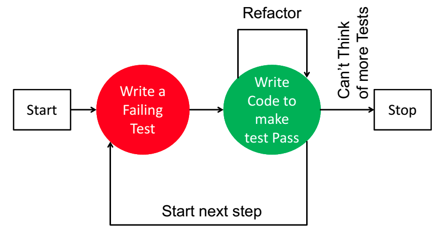

(VuPDH)
# 3.Viết unit test như thế nào
TDD là gì?
- Trước giờ MN implement code như thế nào, code trước rồi sau đó viết test cho đoạn code đó hay viết test trước rồi code cho các test đó pass
- Hôm nay mình xin giới thiệu với mọi người một kỹ thuật lập trình là TDD, kỹ thuật này chắc hẳn không xa lạ gì với nọi người và hôm trước anh Hoàng Nhạc Trung cũng có một buổi chia sẽ về kỹ thuật này rồi. TDD tức là "viết test trước khi viết code", kỹ thuật sau gồm các bước



1. Viết test, chạy teđst và đảm bảo nó failed, nếu không có test nào thì stop
2. Viết code để pass test ở bước 1
3. Refactor lại code sau đó chạy lại test, nếu failed quay lại b2, nếu pass quay về b1

Các nguyên tắc trong TDD
- Không cho phép viết bất kỳ một mã chương trình nào cho tới khi nó làm một test bị fail trở nên pass. tức là luôn viết test trước, khi có test fail mình mới viết code
- Không cho phép viết nhiều hơn một unit test mà nếu chỉ cần 1 unit test cung đã đủ để fail. Hãy chuyển sang viết code function để pass test đó trước.
- Không cho phép viết nhiều hơn 1 mã chương trình mà nó đã đủ làm một test bị fail chuyển sang pass.

Thực hành

Cho một số n tương ứng là giờ, viết một hàm để dựa vào giờ để trả về khoảng tg trong ngày

n nằm trong khoảng 1-12 trả về morning
n nằm trong khoảng 13-17 trả về affternoon
n nằm trong khoảng 18-24 trả về evening
n không nằm trong khoảng trên thì trả về invalid hour

```ruby
RSpec.describe "#get_day_part" do
  it "return sang" do
    expect(get_day_part(2)).to eq "sang"
  end

  # it "return chieu" do
  #   expect(get_day_part(14)).to eq "chieu"
  # end

  # it "return toi" do
  #   expect(get_day_part(17)).to eq "toi"
  # end
end
```

Hi vọng ví dụ trên sẽ giúp mọi người hiểu hơn về TDD, Vậy thì trong một dự án rails thì mình nên test những phần nào, mình nên test tất cả những gì mình viết ra

## 3.1 Model
- test validate
```ruby
require 'rails_helper'

RSpec.describe Customer, type: :model
  describe "Validations" do
    let(:customer) { build :customer }

    it "is valid with valid attributes" do
      expect(customer).to be_valid
    end

    it "is not valid without a name" do
      customer.name = nil
      expect(customer).to_not be_valid
    end

    it "is not valid with a name exceed 100 characters" do
      customer.name = "a" * 101
      expect(customer).to_not be_valid
    end
  end
end
```

- test các method trong model
```ruby
require 'rails_helper'

RSpec.describe Customer, type: :model
  describe "methods" do
    describe "#frequent_customer?" do
      let(:customer) { build :customer }

      it "return true when frequency >= 10" do
        customer.frequency = 10
        expect(customer.frequent_customer?).to eq true
      end

      it "return false when frequency < 10" do
        # TO-DO
      end
    end
  end
end
```

- test scope
```ruby
require 'rails_helper'

RSpec.describe Customer, type: :model
  describe "scope" do
    describe ".by_month" do
      before { create :customer, birthdate: "1997-03-28" }

      it{expect(Customer.by_month("03/1997".to_date)).to eq [customer]}
    end
  end
end

```

- test association
```ruby
RSpec.describe Customer, type: :model
describe "relationships" do
    it do
      is_expected.to belong_to :group
      is_expected.to have_many :orders
    end
  end
end
```

## 3.2 Controller
- Test status code
```ruby
require "rails_helper"

RSpec.describe CustomersController, type: :controller do
  let(:user){create :user}

  describe "GET #index" do
    context "when get success" do
      before do
        allow(controller).to receive(:current_user).and_return user
        get :index
      end

      it "expect output of response's status and body is 200" do
        expect(response.status).to eq 200
      end
    end

    context "when user not login" do
      before { get :index }

      it "expect output of response's status and body is 400" do
        expect(response.status).to eq 400
      end
    end
  end
end
```

- Test sự ảnh hưởng của dữ liệu đối với các action create, update, delete
```ruby
require "rails_helper"

RSpec.describe CustomersController, type: :controller do
  let(:user){create :user}

  describe "PATCH #update" do
    let(:customer){create :customer, name: "John"}
    context "when update success" do
      let(:params) do
        {
          id: customer.id,
          customer: {
            name: "Wick"
          }
        }
      end

      before do
        patch :update, params: params
      end

      it "expect output of response's status and body is 200" do
        expect(response.status).to eq 200
      end

      it "expect record in database changed correctly" do
        expect(Customer.find(customer.id).name).to eq "wick"
      end
    end
  end
end
```

Ngoài ra còn có service, helper, ở những phần này chúng ta nên test tất cả các đoạn code có ở trong service đó.
đa phần các bạn lập trình viên mới thường bị mê hoặc bởi con số 100% cover code, tuy nhiên trong khái niệm của test ngoài cover code thì còn có cover case nữa. xét ví dụ dưới đây

- Vậy theo mọi người khi viết test thì viết như thế nào là đúng và như thế nào là đủ? để trả lời cho câu hỏi trên thì mình sẽ đi đến các khái niệm về độ bao phủ code lần lượt là C0, C1, C2


## 3.4 Các khái niệm C0, C1, C2
### 3.4.1 C0: Tỉ lệ bao phủ câu lệnh (Statement coverage)

```ruby
  def foo(x)
    z = 0

    if x > 0
      z = x
    end

    return z
  end
```
foo(1)

### 3.4.2 C1: Tỉ lệ bao phủ nhánh (Branch Coverage)
cover tất cả các nhánh của lệnh if

```ruby
  def foo(x)
    z = 0

    if x > 0
      z = x
    end

    return z
  end
```
foo(1), foo(0)

### 3.4.3 C2: Tỉ lệ bao phủ điều kiện (Condition Coverage)
cover tất cả các điều kiện có trong đoạn code

```ruby
  def foo(x, y)
    z = 0

    if x.positive? || y.positive?
      z = x
    end

    return z
  end
```

foo(1, 1) -> 100% c0

foo(-1, -1) -> 100% c1

foo(0, -1) -> 50% c2

foo(-1, 0) -> 50% c2

convention
#: instance method

.: class method

- TDD
- thực hành
- những cái cần tets, tiêu chí test
- cover code cover case
